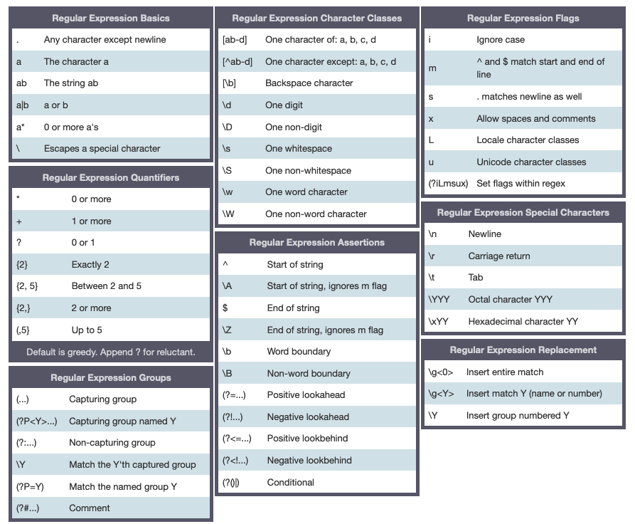

# Text Mining

## Working with strings

```{python, eval=F}
import this
```

### String Types

```{python}
new_string = "This is a String"  # storing a string

print(f'ID: {id(new_string)}')  # shows the object identifier (address)
print(f'Type: {type(new_string)}')  # shows the object type (type(new_string)
print(f'Value: {new_string}')  # shows the object value
```

```{python}
simple_string = 'Hello!' + " I'm a simple string"
print(simple_string)

# multi-line string, note the \n (newline) escape character automatically created
multi_line_string = """Hello I'm
a multi-line
string!"""

multi_line_string
print(multi_line_string)
```

Be careful when writing raw strings, regex will escape them.

```{python}
# Normal string with escape sequences leading to a wrong file path!
escaped_string = "C:\the_folder\new_dir\file.txt"
print(escaped_string)
```

In order to keep the backslashes, use `r''` to define a raw string:

```{python}
# raw string keeping the backslashes in its normal form
raw_string = r'C:\the_folder\new_dir\file.txt'
print(raw_string)
```

### Strings Operations

```{python}
# concatenation of variables and literals
s1 = 'Python 💻!'
'Hello 😊 ' + s1
s1*5
```

```{python}
# concatenating several strings together in parentheses
s3 = ('This '
      'is another way '
      'to concatenate '
      'several strings!')
s3
```

Checking for substrings in a string:

```{python}
'way' in s3, 'python' in s3
```

Computing total length of the string:

```{python}
len(s3)
```

### Strings Conversion

```{python}
s = 'python is great'
s.capitalize(), s.upper(), s.title(), s.replace('python', 'R')
```

Checking for numbers and alphabet

```{python}
#.isdecimal() checks only for numeric strings
'12345'.isdecimal(), 'apollo11'.isdecimal()

#.isalpha() checks only for numeric strings
'python'.isalpha(), 'number1'.isalpha()

#.isalpha() checks for alphanumeric strings, not just numeric strings
'total'.isalnum(),'abc123'.isalnum(), '1+1'.isalnum()
```

### String Indexing and Slicing

```{python}
s = 'PYTHON'
for index, character in enumerate(s):
    print(f'Character -> {character} has index-> {index}')

s[0], s[1], s[2], s[3], s[4], s[5]
```

```{python}
s[:], s[1:4], s[:3], s[3:], s[-3:], s[:3] + s[-3:]
```

### String splitting and joining

```{python}
s = 'I,am,a,comma,separated,string'
s.split(',') 
' '.join(s.split(','))
```

```{python}
# stripping whitespace characters
s = '   I am surrounded by spaces    '
s, s.strip()
```

```{python}
s = 'Python is great. NLP is also good.'
s.split('.')
```

```{python}
print('\n'.join(s.split('.')))

print('\n'.join([s.strip() for s in s.split('.') if s]))
```

## Regular Expressions

Regular expressions are a powerful tool for various kinds of string manipulation. They are a domain specific language (DSL) that is present as a library in most modern programming languages, not just Python.

Regular expressions in Python can be accessed using the `re` module, which is part of the standard library.

```{python}
import re

s1 = 'Python is an excellent language'
s2 = 'I love the Python language. I also use Python to build applications at work!'
```

### Match & Find

The `match()` function only returns a match if a match is found at the beginning of the string `s1`.

```{python}
pattern = 'python'

re.match(pattern, s1), re.match(pattern, s1, flags=re.IGNORECASE)
```

`pattern` is in lower case, hence `ignore case` flag helps in matching same pattern with different cases.

Other functions to match patterns are `re.search()` and `re.findall()`. The function `re.search()` finds a match of a pattern anywhere in the string. The function `re.findall()` returns a list of all substrings that match a pattern.

```{python}
re.search(pattern, s2, re.IGNORECASE)
re.findall(pattern, s2, re.IGNORECASE)
```

There is also `re.finditer()` which does the same, except it returns an iterator rather than a list

```{python}
print(f'String: {s2}')
for m in re.finditer(pattern, s2, re.IGNORECASE):
    print(f"Found match '{m.group(0)}' ranging from index {m.start()} - {m.end()}")
```

The regex search returns an object with several methods that give details about it. These methods include group which returns the string matched, start and end which return the start and ending positions of the first match.

```{python}
print('Found match {} ranging from index {} - {} in the string "{}"'.format(
	re.match(pattern, s1, flags=re.IGNORECASE).group(0),
	re.match(pattern, s1, flags=re.IGNORECASE).start(),
	re.match(pattern, s1, flags=re.IGNORECASE).end(), s1))
```

### Search & Replace

One of the most important re methods that use regular expressions is `.sub()`.

This method replaces all occurrences of the pattern in string with repl, substituting all occurrences, unless count provided. This method returns the modified string.

```{python}
re.sub(pattern, 'R', s2, flags=re.IGNORECASE)
```

### Metacharacters 

Metacharacters are what make regular expressions more powerful than normal string methods.

They allow you to create regular expressions to represent concepts like "one or more repetitions of a vowel".

The existence of metacharacters poses a problem if you want to create a regular expression (or regex) that matches a literal metacharacter, such as "\$".

::: {style="color: gray;"}
You can do this by escaping the metacharacters by putting a backslash in front of them.
:::

However, this can cause problems, since backslashes also have an escaping function in normal Python strings. This can mean putting three or four backslashes in a row to do all the escaping.



#### Example: Email Extraction

To demonstrate a sample usage of regular expressions, lets create a program to extract email addresses from a string. Suppose we have a text that contains an email address: `str = "Please contact info@sololearn.com for assistance"`. Our goal is to extract the substring "*info\@sololearn.com*".

A basic email address consists of a word and may include dots or dashes. This is followed by the \@ sign and the domain name (the name, a dot, and the domain name suffix).

This is the basis for building our regular expression.

```{python}
pattern = r"([\w\.-]+)@([\w\.-]+)(\.[\w\.]+)"
str = "Please contact info@sololearn.com for assistance"

match = re.search(pattern, str)
if match:
    print(match.group())
```

`[\w\.-]+` matches one or more word character, dot or dash.

The regex above says that the string should contain a word (with dots and dashes allowed), followed by the \@ sign, then another similar word, then a dot and another word.
